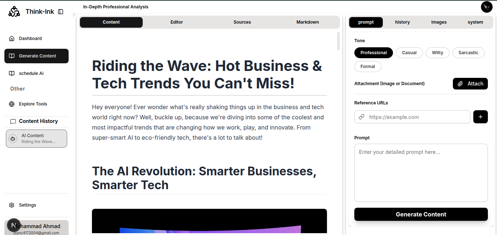

# ThinkInk: AI-Powered Content Generation

<p align="center">
  
</p>

<p align="center">
  <strong>ThinkInk is a powerful, AI-driven content generation platform designed for content creators.</strong>
  <br />
  It leverages cutting-edge Retrieval-Augmented Generation (RAG) to ensure generated outputs are not only stylish and well-structured but also grounded in real-time, verifiable facts—eliminating common AI hallucinations.
</p>

---

## 📋 Table of Contents

- [✨ Features](#-features)
- [🛠️ Tech Stack](#-tech-stack)
- [🚀 Getting Started](#-getting-started)
- [📜 Available Scripts](#-available-scripts)
- [📄 License](#-license)

---

## ✨ Features

- **Fact-Grounded Generation (RAG):** Utilizes the **Tavily Search API** within an AI tool-calling workflow to gather real-time data, ensuring all generated content is highly accurate and up-to-date.
- **Structured, Presentation-Ready Output:** The AI is meticulously prompted to generate content, complete with strict formatting rules, clear headings, and visual placeholders for easy frontend rendering.
- **Real-time Streaming:** Content is streamed instantly from the server using the **Vercel AI SDK**, providing a dynamic and highly responsive user experience.
- **Professional Styling:** Markdown is rendered using the **Tailwind Typography plugin**, offering polished, magazine-quality styling for all text and data elements (tables, lists, code).
- **Secure Authentication:** **Supabase** is used for robust, scalable user authentication, including support for **Google OAuth**.
- **Modern UI/UX:** A sleek and intuitive interface built with Next.js, **Tailwind CSS**, and **shadcn/ui**.
- **Scheduled Content Generation:** Automatically generate content based on trends or a schedule using cron jobs.
- **Image Search:** Find and embed images from Unsplash directly into your content.
- **DOCX Export:** Export your generated content to a `.docx` file.

---

## 🛠️ Tech Stack

| Category | Component | Purpose |
| :--- | :--- | :--- |
| **Framework** | [Next.js](https://nextjs.org/) | Modern, full-stack React framework. |
| **AI/RAG** | **Google Gemini API** & **Vercel AI SDK** | Core generation and streaming. |
| **Data Retrieval** | **Tavily AI** | Real-time, fact-checking search API. |
| **Database/Auth** | **Supabase** | Secure user authentication and management. |
| **Styling/UI** | [Tailwind CSS](https://tailwindcss.com/) & [shadcn/ui](https://ui.shadcn.com/) | Modular, utility-first styling and component library. |
| **Language** | [TypeScript](https://www.typescriptlang.org/) | Enhanced code reliability and maintainability. |
| **State Management** | [React Context API](https://react.dev/reference/react/createContext) | Application state management. |
| **Icons** | [Lucide React](https://lucide.dev/guide/packages/lucide-react) | Vector icons for the UI. |

---

## 🚀 Getting Started

To get a local copy up and running, follow these simple steps.

### Prerequisites

- Node.js (v18 or higher)
- npm or yarn

### Installation

1.  **Clone the repository:**
    ```sh
    git clone https://github.com/AllForTech/Think-Ink_content_generate.git
    ```

2.  **Install dependencies:**
    ```sh
    npm install
    ```

3.  **Set up environment variables:**
    - Create a `.env.local` file in the root of your project.
    - Copy the contents of `.env.example` into your new `.env.local` file.
    - Fill in the required API keys and credentials.

4.  **Run the development server:**
    ```sh
    npm run dev
    ```

5.  Open [http://localhost:3000](http://localhost:3000) with your browser to see the result.

---

## 📜 Available Scripts

In the project directory, you can run:

| Script | Description |
| :--- | :--- |
| `npm run dev` | Runs the app in development mode. |
| `npm run build` | Builds the app for production. |
| `npm run start` | Starts a production server. |
| `npm run lint` | Lints the code using ESLint. |
| `npm run format` | Formats the code using Prettier. |

---

## 📄 License

Distributed under the MIT License. See `LICENSE` for more information.
